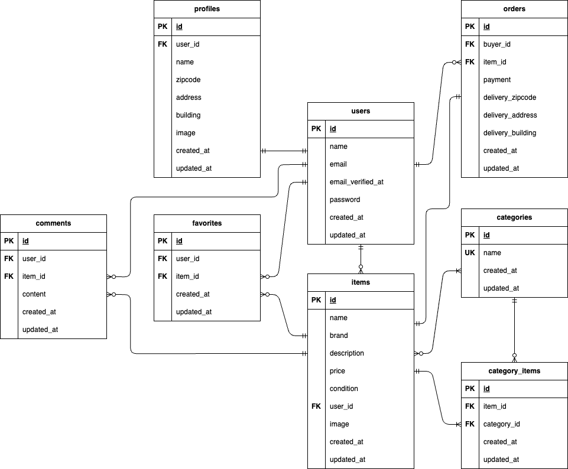

# coachtechフリマアプリ

## 概要
アイテムの出品と購入ができるフリマアプリです。ゲストユーザーは、商品一覧画面と商品詳細画面を閲覧できます。  
会員登録をすると、いいね・コメント・マイリスト登録・商品の購入・出品といった機能が利用できます。

## 環境構築

### Dockerビルド
1. git clone git@github.com:aika-nag/coachtechflema.git
2. docker-compose up -d --build

※MySQLは、OSによって起動しない場合があるのでそれぞれのPCに合わせてdocker-compose.ymlファイルを編集してください。

### Laravel環境構築
1. docker-compose exec php bash
2. composer install
3. .env.exampleファイルから.envを作成し、環境変数を変更  
   (DB項目の他に、MAIL_FROM_ADDRESSにもメールアドレスを設定してください）  
   例）MAIL_FROM_ADDRESS = "hello@example.com"  
5. php artisan key:generate
6. php artisan migrate
7. php artisan db:seed
8. php artisan storage:link 
   ダミーの商品画像は　public/images　の中にdammy1~10まで入れています。 
   商品画像が表示されなくなった時は上記画像をstorage/app/public/images　に入れ直してください。

## 使用技術（実行環境）
- PHP8.4.1
- JavaScript
- Laravel8.83.8
- MySQL8.0.26
- nginx1.21.1
- mailhog1.0.1

## ER図

## URL
- 開発環境： http://localhost/
- ユーザー登録： http://localhost/register
- phpMyAdmin: http://localhost:8080/
- mailhog: http://localhost:8025/

## サンプルアカウント
UsersTableSeederによりあらかじめメール認証済みのログイン用ユーザーが２名登録されています。  
開発時や動作確認の際にご利用ください。
- ログインURL：http://localhost/login
### 🔑サンプルユーザー情報
1. 山田花子（出品商品なし）
   - Email   : hanako@test.jp
   - Password: coachhanako
2. 鈴木一郎（ダミー商品１〜５を出品）
   - Email   : ichiro@test.jp
   - Password: techichiro

## テスト
PHPUnitを用いた自動テストを導入しています。主要な実装機能ごとにテストケースを用意しています。  
下記の方法でご利用ください。
### テスト実行
1. docker-compose exec php bash
2. php artisan test

上記の方法では全機能のテストを一度に行います。
各機能ごとにテストを行いたい場合は、上記２において
php artisan test tests/Feature/LoginTest.php  
のようにファイル名を指定してください。
